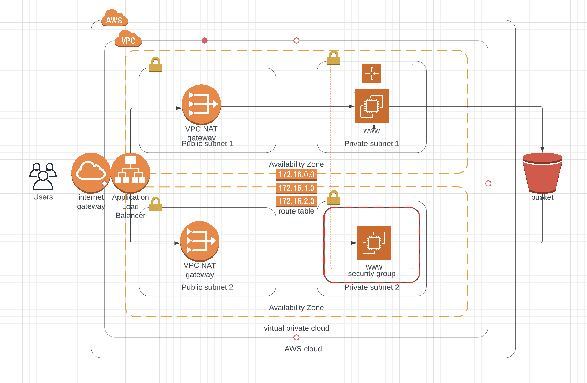

### Deploy a high-availability web app using CloudFormation

This folder provides the code for the "ND9991 - C2- Infrastructure as Code - Deploy a high-availability web app using CloudFormation" project. This folder contains the following files:

#### network.yml
Help create network infrastructure for our webserver

#### network-parameters.json
Contains parameter for network infrastructure. You can change Ip range for subnet.

#### servers.yml
This is cloudformation template help building the cloud infrastructure for start our webservice. 

#### server-parameters.json
Contains parameter for server infrastructure. 

#### index.html
Example of our webserver. You can replace this with your webapp.

#### create.sh 
Script help create stack in cloudformation

#### deploy.sh
Script help start our webservice.

## To start webapp. Please run script: deploy.sh
My demo WebappURL: http://Creat-WebAp-BMHX1RHZ62O7-1410478662.us-east-1.elb.amazonaws.com